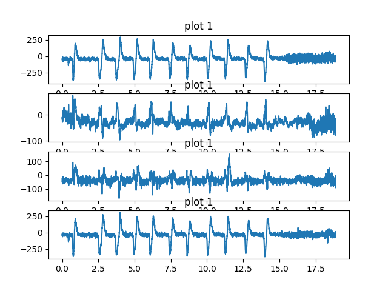

# hackathon_spiral_game
This is a simple demo for a puzzle game which is controlled by BCI devices. 

## device
[Muse2](https://choosemuse.com/muse-2/)

## control signal
EEG signal when blinking

## install and run
```
pip install -r requirements.txt
python SpiralGame.py
```

## details
inside <i>data_process</i> folder there are scripts for visualizing data. Using those data, we figured out what does the eye blink signal looks like and thus programming accordingly.

<div align=center></div>

inside <i>getData</i> folder there are scripts for get live data from muse2, thanks to [NeuralAlbertaTech](https://github.com/neuralbertatech/natHACKS_2022_Python_Boiler) providing boilerplate

The game's rule is very simple. choose one block as the start block, and continually choose a direction so that go through each block(other than those red ones) one and only once. Continuous blinkings are used to confirm your start point and directions.

<div align=center></div>

Enjoy!
